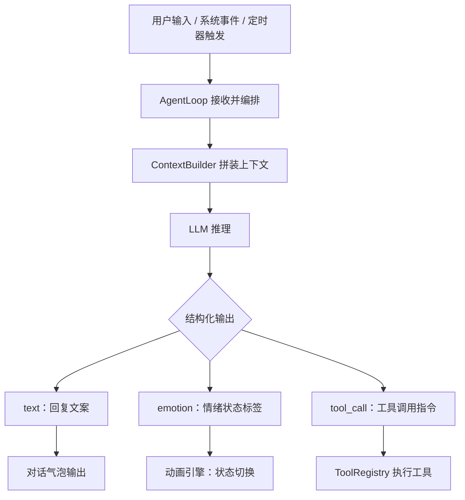

# ClawPet 智能虚拟桌宠 —— 产品需求文档（PRD）

| 文档信息 | 详情 |
|---|---|
| 产品名称 | ClawPet（智能虚拟桌宠） |
| 文档版本 | v1.0 |
| 创建日期 | 2026-03-26 |
| 目标平台 | Windows / macOS 桌面端 |
| 技术底座 | PicoClaw |

---

# 一、为什么是我们？（Why & Market Hook）

## 1.1 时代背景与核心痛点
随着大模型产品从网页问答场景逐步向桌面常驻、系统深度协作演进，用户对 AI 的核心预期正发生本质变化。用户不再满足于一个“可对话的信息回答者”，而是迫切需要一个能够长期陪伴、精准理解情绪、敏锐感知场景，并在必要时提供轻量高效辅助的桌面智能体。

## 1.2 核心需求：

### 1.2.1 情感陪伴需求

对于长时间独自使用电脑的用户（尤其是女性用户、极客、自由职业者及数字游民）而言，AI 早已超越单纯的信息工具属性，更承担着情绪支持、陪伴慰藉与正向反馈的角色。这类用户期待 AI 具备持续稳定的人格特质、长期记忆能力、主动关怀意识，以及更具温度、更贴近生活化的交互方式。

### 1.2.2 桌面辅助需求

在日常电脑使用过程中，用户频繁面临信息查询、轻量提醒、内容整理、简单代办等碎片化事务。传统工具虽能分别解决部分单点问题，但存在切换成本高、表达形式机械、缺乏上下文延续性等痛点，难以形成自然流畅的一体化体验，无法满足用户“随手可用、贴心适配”的核心期待。

ClawPet 的立项初衷，正是为了同时回应上述两类核心需求。产品的核心目标并非打造一款纯聊天工具，也不是开发一个冷冰冰的桌面命令执行器，而是构建一种全新的产品形态——兼具陪伴感、记忆感与轻量工具能力的桌面虚拟伴侣，实现“情感陪伴 + 高效辅助”的无缝融合。

---

## 1.3 用户痛点

当前市场主流产品，大多只能覆盖用户单一需求，难以完整承接桌面场景下“情绪价值 + 轻量代办”的复合诉求。结合 ClawPet 的产品方向，目标用户的核心痛点可归纳为以下 5 点：

### 1.3.1 情绪表达被接收，但缺乏共情回应

传统 AI 助手虽能识别文本表面含义，却**缺乏对用户情绪状态的精准感知与共情反馈**。当用户表达低落、委屈、疲惫等负面情绪时，系统往往仅给出理性化回答，无法通过语气、动画、互动形式传递安抚感，导致陪伴价值大打折扣，难以满足用户的情绪慰藉需求。

### 1.3.2 信息可以获取，但缺乏“有温度的转译”

天气、日历、提醒等工具虽能提供准确的信息结果，但信息呈现方式普遍偏向功能化、模板化，缺乏生活化的关怀表达，**难以转化为引导用户主动行动的有效提醒**。用户真正缺少的并非信息本身，而是基于信息延伸的、有温度的生活化关怀与陪伴感。

### 1.3.3 用户说过的话无法形成持续记忆

许多重要的计划、个人偏好与情绪线索，往往产生于自然聊天过程，而非正式的任务录入。**现有产品通常无法对这些碎片化表达进行长期沉淀、精准存储与主动唤起**，导致用户“说过的话没有被记住”，无法建立起真实的情感连接与连续的产品体验，难以形成用户依赖。

### 1.3.4 陪伴产品与工具产品长期割裂

**当前市场产品呈现明显的两极分化**：陪伴型产品擅长建立情感关系、提供情绪支持，但缺乏真实的工具执行能力，无法解决用户的实际事务需求；效率型产品侧重任务执行与流程处理，却缺乏人格感与情绪价值，显得冰冷机械。用户在实际使用中需在两类产品间频繁切换，体验割裂，难以建立稳定的使用习惯。

### 1.3.5 用户期待主动性，但不接受失控式介入

用户希望系统能够在合适的时机主动提醒、主动关心、主动提供辅助，但这一需求的前提是：**系统具备清晰的交互边界、适度的介入频率与可控的操作权限**。若主动性缺乏合理依据，或介入方式过于强硬、频繁，产品体验会迅速从“贴心”转变为“打扰”，反而降低用户好感度。

---

## 1.4 竞品调研与破局点
当前市场产品呈现明显的两极分化，而这正是 ClawPet 的破局点。

### 竞品分析
### 1.4.1 OpenClaw

OpenClaw 更偏向智能体底层技术框架，主要面向开发者，提供 Agent 框架、工具调用接口与底层能力输出。它的优势在于技术扩展性强、工具接入能力深，但缺乏普通用户可直接使用的可视化产品形态，也不具备情绪陪伴相关设计。

### 1.4.2 NeuroSama（类产品）

NeuroSama（类产品）代表的是偏虚拟陪伴方向的 AI 产品形态，侧重人格化互动、情绪表达与角色陪伴，能够提供较强的情绪价值与存在感，但工具能力较弱，难以进入真实桌面任务场景。

### 1.4.3 传统AI产品

这一类产品强调长期互动、情绪支持和拟人化交流，适合承接用户的孤独感和表达欲，但普遍缺乏真实的工具联动能力，难以帮助用户完成具体事务。

### 1.4.4 自动化 / RPA 产品

这一类产品擅长处理规则明确、重复性高的数字任务，执行能力强，但表达形式冷、配置门槛高，缺少陪伴感和情绪价值，不适合普通消费级用户的日常桌面陪伴场景。

### 竞品对比矩阵
| 对比维度 | ClawPet | OpenClaw | NeuroSama（类产品） |
|---|---|---|---|
| **产品定位** | **桌面虚拟陪伴 + 轻量辅助智能体** | 智能体底层技术框架（面向开发者） | 虚拟陪伴型 AI（侧重情感互动） |
| **核心能力** | **情感陪伴、长期记忆、轻量工具调用、可视化交互** | Agent 框架、工具调用接口、底层能力输出 | 情感互动、人格化对话、基础场景响应 |
| **情绪价值** | **高，支持情绪识别、情感化回复与动画反馈** | 无，仅提供底层技术，无情感设计 | 高，侧重人格化情感互动，缺乏工具能力 |
| **工具辅助能力** | **中上，支持天气提醒、文件整理等轻量工具** | 强，可扩展多种工具接口，需二次开发 | 弱，仅支持基础场景响应，无实用工具能力 |

### 我们的核心产品优势
综合竞品对比，ClawPet 的优势不在于单一维度做到最强，而在于将“情感陪伴”与“轻量工具辅助”整合为统一体验：
1.  **比底层框架更贴近用户**：一键安装、桌宠形象和图形化交互，大幅降低使用门槛。
2.  **比纯陪伴产品更有实用价值**：不仅能聊天，还能在天气、提醒、文件整理等场景下提供轻量辅助，形成真实任务闭环。
3.  **比传统工具更有温度**：通过长期记忆、情绪识别、动画反馈和主动提醒，建立更强的关系感和持续使用动机。

## 1.5 产品核心定义
ClawPet 并非独立开发的底层引擎，也不是一个冷冰冰的桌面命令执行器，而是一款**兼具陪伴感、记忆感与轻量工具能力的桌面虚拟伴侣**。我们致力于解决三个核心问题：
1.  **让桌宠具备真实的情绪价值**：精准识别情绪并通过多模态方式共情回应。
2.  **让工具能力服务于陪伴体验**：传递“它在关心我，并顺手帮我解决了小麻烦”的体验。
3.  **让主动性建立在记忆与情境之上**：基于明确的用户历史表达或场景状态进行判断，而非简单定时触发。

---

# 二、我们在为谁解决问题？（Who & Scenarios）

## 2.1 核心用户画像
ClawPet 第一阶段聚焦于具备明确桌面使用强度、清晰情绪陪伴需求与轻量辅助需求的三类核心人群。

* **高压打工人（核心）**：22-35岁，工作强度大，情绪消耗快。他们对AI的核心期待是**“情绪共鸣者”**，希望在低落时获得温暖的安抚。
* **粗心独居者**：20-30岁，生活佛系，易忽视日常事项。他们需要一个**“有温度的生活助手”**，将冰冷信息转化为主动提醒。
* **多线程工作者**：25-40岁，日常任务繁杂，讨厌频繁切换工具。他们需要**“贴心记忆助手”**，记住随口表达并提供轻量辅助。

## 2.2 核心用户故事 (Aha Moment)
结合上述画像，以下三个场景精准匹配了产品价值：

### 故事 1：高压打工人·情绪安抚场景
作为一名互联网运营，我每天加班到深夜，面对繁杂的工作和 KPI 压力，经常感到疲惫、焦虑。打开 ClawPet 后，我随口和它说“今天好累，KPI 又没完成，感觉自己好没用”，它能快速识别我的低落情绪，不仅用温柔的语气安慰我，还会切换委屈陪伴的 Live2D 动画。没有生硬的道理，只有共情的回应，让我感受到被理解、被安抚，缓解当下的负面情绪。

### 故事 2：粗心独居者·生活提醒场景
作为一名自由职业者，我经常出门忘带伞、忘记按时吃饭。某天早上我和 ClawPet 闲聊时说“明天要去见客户，希望别下雨”，它默默记住这句话。第二天早上，它主动弹出提醒，带着可爱的动画说“宝～ 今天有小雨哦，记得带伞”；到了中午 12 点，它又会主动提醒我“该吃饭啦”。它把冰冷的天气、时间信息变成有温度的关怀。

### 故事 3：多线程工作者·记忆提醒场景
作为一名项目管理者，我经常随口和同事沟通完计划转头就忘记。某天我在电脑上和 ClawPet 说“下午 3 点要开项目复盘会，别忘了提醒我”，它会自动提取这句话并存储到长期记忆中。下午 2 点 50 分，它会通过桌面弹窗 + 敲玻璃动画主动提醒我“宝，还有 10 分钟就要开会啦”。这种不用特意记录待办的体验，极大地减轻了我的事务管理压力。

- 换一个例子：完成任务的例子
---

# 三、我们怎么做到？（How & Solution）

## 3.1 核心形态与能力边界
从产品形态上，ClawPet 采用“**常驻后台服务 + 轻量化前端交互界面**”的组合方式。其核心能力具备六个方面：
1.  **上下文感知与事件驱动**：持续感知桌面活动与状态。
2.  **多 Agent 协作与任务拆解**：面向复杂任务的分工协作。
3.  **系统能力调用**：统一工具层调用本地命令行、文件系统等。
4.  **安全透明可控**：执行过程可见、可确认，并具备权限与沙箱机制。
5.  **记忆与学习**：记录偏好与习惯，提升主动性与准确性。
6.  **陪伴感与人格化**：保留可配置的人格和视觉 / 声音表达。

## 3.2 功能清单总览
为了实现 MVP，我们规划了以下优先级功能模块：

| 用户需求 | 对应功能点 | 优先级 |
|---|---|---|
| 在心情低落时获得安慰和陪伴 | 情绪识别引擎 + 情感化回复生成 + 情绪动画系统 | P0 |
| 日常闲聊，感觉像和真人对话 | 人格化对话系统（一致性人设 + 长期记忆） | P0 |
| 查天气等信息时得到有温度的反馈 | 外部 API 调用 + LLM 情感化数据转译 | P0 |
| 随口提到的计划能被记住并主动提醒 | 长期记忆库 + 定时记忆扫描 + 主动唤醒机制 | P0 |
| 拖拽文件让桌宠帮忙整理 | 文件拖拽监听 + 本地文件整理工具 + 任务动画 | P1 |

## 3.3 核心逻辑与产品架构
ClawPet 的核心运行逻辑归纳为一条统一的 **“感知 -- 思考 -- 执行”** 处理链路：

**关键设计决策：**
* **结构化输出驱动**：LLM 统一输出 JSON（包含文案、情绪标签、工具指令），应用层解析后并行执行动画切换与工具调用。
* **情绪状态机**：应用层维护状态机，确保情绪表现连贯稳定，不完全依赖 LLM 实时判断。
* **PicoClaw 底座**：底层基于四大核心组件（AgentLoop、AgentInstance、ContextBuilder、ToolRegistry）保障可扩展性。
* **轻量级记忆与人设**：长期记忆采用 `MEMORY.md` 存储；情感人设通过 `SOUL.md`、`IDENTITY.md`、`USER.md` 定义，修改实时生效。

### 功能架构图

```mermaid
graph TD
  Root["ClawPet 功能架构"]

  Root --> FE["前端展示层"]
  Root --> Core["核心逻辑层"]
  Root --> Tool["工具调用层"]
  Root --> Infra["基础设施层"]

  FE --> FE1["桌宠渲染引擎 Live2D"]
  FE --> FE2["对话气泡 UI"]
  FE --> FE3["悬浮窗管理"]
  FE --> FE4["设置面板"]

  Core --> C1["AgentLoop 消息编排中心"]
  Core --> C2["AgentInstance 状态容器"]
  Core --> C3["ContextBuilder 提示词工程"]
  Core --> C4["ToolRegistry 工具管理"]
  Core --> C5["记忆系统"]
  Core --> C6["情绪状态机"]
  Core --> C7["主动行为引擎"]

  Tool --> T1["天气查询服务（外部 API）"]
  Tool --> T2["音乐播放控制（系统 API）"]
  Tool --> T3["文件整理工具（本地文件系统）"]
  Tool --> T4["应用启动器（系统命令）"]

  Infra --> I1["PicoClaw 智能体引擎"]
  Infra --> I2["工作区 ~/.picoclaw/workspace/"]
  Infra --> I3["配置管理 config.json"]
  Infra --> I4["MCP 协议外部服务桥接"]
```

*(注：为保证汇报时的可视性，架构图子节点已适当收敛)*

---

# 四、落地节奏与未来想象（Roadmap & Vision）

## 4.1 项目目标与里程碑
项目总周期 1.5 个月，每 2 周设置一次里程碑验收。

| 阶段 | 时间区间 | 交付物 | 核心验收条件摘要 |
|---|---|---|---|
| **M0** | 03.12—03.29 | 产品设计验证 | 原型图具备；PicoClaw 技术可行性验证完成 |
| **M1** | 03.29—04.08 | 核心跑通版本 | Live2D 动画切换正常；有记忆能对话；记忆提取与定时主动提醒跑通 |
| **M2** | 04.09—04.23 | MVP 上线版本 | 天气/音乐工具调通；启动 ≤ 3s、内存 ≤ 150MB；无 P0/P1 缺陷 |

## 4.2 结论

ClawPet 基于 OpenClaw / PicoClaw 底层能力做应用层优化，吸收陪伴型产品的情绪价值优势，同时保留智能体工具扩展的潜力，以“一键安装、情感陪伴、轻量辅助、可视化交互”的组合方式形成差异化竞争力。其核心竞争优势在于：**精准填补了当前市场中“陪伴与效率割裂”的空白，更贴合普通用户在桌面环境中的真实使用需求。**

## 4.3 产品愿景

ClawPet 的目标并不止于完成一款桌宠产品。桌宠只是产品的起点，是用户感知陪伴价值与工具价值的第一层入口。

从长期来看，ClawPet 希望构建的是一个围绕“虚拟桌宠”展开的开放平台：用户不仅可以拥有一个能够陪伴自己、理解自己、帮助自己的桌宠，还能够持续定制其形象、人格与能力，使其成为真正具有个人属性的数字伴侣。

在更长远的规划中，ClawPet 还希望进一步开放创作与分发能力，让桌宠不只是被使用的产品角色，也能成为被创造、被订阅、被经营的数字内容载体。用户与创作者可以围绕桌宠形成表达、交易与运营关系，桌宠也可以进一步延展为直播形象、个人品牌或商业 IP 的一部分。

因此，ClawPet 的产品愿景可以概括为：

**以桌宠为入口，先做有温度的桌面虚拟伴侣，再逐步发展为一个支持定制、创作、分发与商业化的桌宠平台。**

PicoClaw 扩展，接入QQ微信与智能桌宠交流，PicoClaw带来的能力