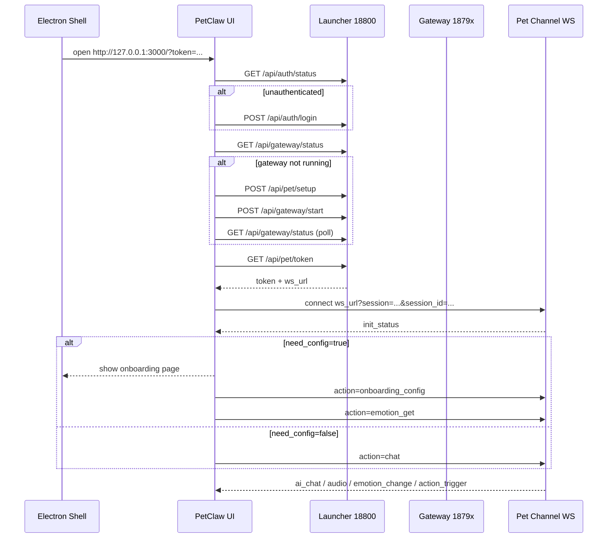

# PetClaw 对接方案

本文档给出当前 `picoclaw + petclaw + electron-frontend` 的推荐对接方式，目标是把控制台、初始化页、桌宠小窗统一到一套稳定链路中。

## 1. 总体方案

推荐采用三层结构：

1. `launcher` 作为控制面
2. `pet` 通道作为聊天与初始化的数据面
3. `electron` 作为桌面壳层与桌宠展示层

建议把职责固定为：

- `launcher`
  - 登录鉴权
  - 查询 / 启动 / 重启 gateway
  - 代理 `pet` token
  - 代理 WebSocket
- `gateway`
  - 真正执行模型调用与宠物业务逻辑
  - 真实监听端口可能从 `18790` 漂移到 `1879x`
- `petclaw`
  - 主控制台
  - 初始化页
  - 聊天页
- `electron-frontend`
  - 小尺寸桌宠 GIF 窗口
  - 打开 `petclaw` 控制台程序窗口

## 2. 推荐地址

对接时不要硬编码真实 gateway 端口，只把它当运行时信息。

稳定入口：

- `launcher`: `http://127.0.0.1:18800`
- `petclaw`: `http://127.0.0.1:3000`
- `electron renderer`: `http://127.0.0.1:5173`

动态入口：

- `gateway`: 默认 `http://127.0.0.1:18790`
- 实际运行端口请从运行时配置或启动脚本注入读取

## 3. 启动时序



## 4. 对接原则

### 4.1 入口统一

- 稳定控制入口只认 `launcher`
- 稳定 UI 入口只认 `petclaw`
- 小桌宠窗口不承担主控制台职责

### 4.2 地址解析

- 不要自己拼接 WebSocket 地址
- 必须使用 `/api/pet/token` 或 `/pet/token` 返回的 `ws_url`

### 4.3 端口处理

- 不要在前端写死 `18790`
- gateway 端口冲突时会自动改到 `18791/18792/18793`
- 如果前端需要直连 gateway，请由启动脚本注入 `NEXT_PUBLIC_PICOCLAW_DIRECT_GATEWAY_URL`

### 4.4 就绪判定

不要只靠 `/pet/ws` 预探测判定“网关未就绪”。

推荐判定顺序：

1. `GET /api/auth/status`
2. `GET /api/gateway/status`
3. `GET /api/pet/token`
4. 如果需要，直连 `GET /pet/token`
5. 最后再建立 WebSocket

## 5. HTTP 接口表

### 5.1 Launcher 控制面

Base URL: `http://127.0.0.1:18800`

| Method | Path | 用途 |
| --- | --- | --- |
| POST | `/api/auth/login` | 通过 dashboard token 登录 |
| POST | `/api/auth/logout` | 登出 |
| GET | `/api/auth/status` | 查询当前登录状态 |
| GET | `/api/gateway/status` | 查询 gateway 状态 |
| GET | `/api/gateway/logs` | 查询 gateway 日志 |
| POST | `/api/gateway/logs/clear` | 清空 gateway 日志缓冲 |
| POST | `/api/gateway/start` | 启动 gateway |
| POST | `/api/gateway/stop` | 停止 gateway |
| POST | `/api/gateway/restart` | 重启 gateway |
| GET | `/api/pet/token` | 获取 pet token 与 ws_url |
| POST | `/api/pet/token` | 重置 pet token |
| POST | `/api/pet/setup` | 初始化 pet 通道 |
| GET | `/api/pico/token` | 兼容旧版 token 接口 |
| POST | `/api/pico/token` | 兼容旧版重置 token |
| POST | `/api/pico/setup` | 兼容旧版 setup |
| GET | `/api/config` | 读取主配置 |
| PUT | `/api/config` | 覆盖主配置 |
| PATCH | `/api/config` | 局部更新主配置 |
| GET | `/api/models` | 列出模型 |
| POST | `/api/models` | 新增模型 |
| POST | `/api/models/default` | 设置默认模型 |
| PUT | `/api/models/{index}` | 更新模型 |
| DELETE | `/api/models/{index}` | 删除模型 |
| GET | `/api/channels/catalog` | 读取渠道目录 |
| GET | `/api/channels/{name}/config` | 读取渠道配置 |
| GET | `/api/sessions` | 会话列表 |
| GET | `/api/sessions/{id}` | 会话详情 |
| DELETE | `/api/sessions/{id}` | 删除会话 |
| GET | `/api/skills` | 技能列表 |
| GET | `/api/skills/{name}` | 技能详情 |
| GET | `/api/skills/search` | 搜索技能 |
| POST | `/api/skills/install` | 安装技能 |
| POST | `/api/skills/import` | 导入技能 |
| DELETE | `/api/skills/{name}` | 删除技能 |
| GET | `/api/tools` | 工具列表 |
| PUT | `/api/tools/{name}/state` | 修改工具开关 |
| GET | `/api/system/launcher-config` | 读取 launcher 配置 |
| PUT | `/api/system/launcher-config` | 更新 launcher 配置 |
| GET | `/api/system/autostart` | 查询开机启动 |
| PUT | `/api/system/autostart` | 设置开机启动 |
| GET | `/api/system/version` | 查询版本信息 |
| GET | `/api/update` | 查询更新 |
| GET | `/api/oauth/providers` | OAuth provider 列表 |
| POST | `/api/oauth/login` | 发起 OAuth 登录 |
| GET | `/api/oauth/flows/{id}` | 查询 OAuth flow |
| POST | `/api/oauth/flows/{id}/poll` | 轮询 OAuth flow |
| POST | `/api/oauth/logout` | OAuth 登出 |

### 5.2 Direct Gateway 数据面

Base URL: `http://127.0.0.1:{dynamic-port}`

| Method | Path | 用途 |
| --- | --- | --- |
| GET | `/health` | 健康检查 |
| GET | `/ready` | 就绪检查 |
| GET | `/pet/token` | 直连获取 pet token |
| GET | `/pet/init_status` | 获取初始状态 |
| GET | `/pet/ws` | WebSocket 升级入口 |

## 6. Pet WebSocket 协议

### 6.1 连接方式

使用 `/api/pet/token` 或 `/pet/token` 返回的 `ws_url`。

连接参数建议同时携带：

- `session`
- `session_id`

两者可以使用同一份前端生成的本地 session id。

### 6.2 请求格式

```json
{
  "action": "chat",
  "data": {},
  "request_id": "req-1"
}
```

### 6.3 action 列表

当前代码中真实支持：

| action | 说明 |
| --- | --- |
| `chat` | 聊天 |
| `onboarding_config` | 提交初始化配置 |
| `character_get` | 获取角色配置 |
| `character_update` | 更新角色配置 |
| `character_switch` | 切换角色 |
| `config_get` | 读取应用配置 |
| `config_update` | 更新应用配置 |
| `emotion_get` | 获取当前情绪 |
| `health_check` | 通道健康检查 |
| `memory_search` | 搜索记忆 |
| `conversation_list` | 读取对话列表 |
| `model_list_get` | 获取模型列表 |
| `model_add` | 添加模型 |
| `model_update` | 更新模型 |
| `model_delete` | 删除模型 |
| `model_set_default` | 设置默认模型 |
| `cron_add` | 添加定时任务 |
| `cron_list` | 列出定时任务 |
| `cron_remove` | 删除定时任务 |
| `cron_enable` | 启用定时任务 |
| `cron_disable` | 禁用定时任务 |

### 6.4 push_type 列表

当前代码中真实推送类型：

| push_type | 说明 |
| --- | --- |
| `init_status` | 初始状态 |
| `ai_chat` | AI 文本流 |
| `audio` | 语音流 |
| `emotion_change` | 情绪变化 |
| `action_trigger` | 动作触发 |
| `heartbeat` | 心跳 |
| `character_switch` | 角色切换 |

注意：

- 当前真实代码使用 `audio`
- `PET_CHANNEL_API.md` 中提到的 `ai_audio` 不是当前代码主路径

## 7. 初始化页方案

推荐使用以下状态机：

| 状态 | 说明 |
| --- | --- |
| `boot` | 程序启动 |
| `auth_ready` | launcher 已认证 |
| `gateway_ready` | gateway 运行中 |
| `channel_ready` | token 与 ws_url 可获取 |
| `need_onboarding` | 收到 `need_config=true` |
| `chat_ready` | 正常聊天态 |

推荐流程：

1. 页面启动后先查 `auth/status`
2. 再查 `gateway/status`
3. 如果未启动，执行 `pet/setup` 和 `gateway/start`
4. 取 `pet/token`
5. 建立 WebSocket
6. 收到 `init_status`
7. `need_config=true` 时显示初始化页
8. 提交 `onboarding_config`
9. 成功后发送 `emotion_get`
10. 关闭初始化页，进入聊天页

## 8. Electron 集成建议

推荐拆成两个窗口：

### 8.1 petWindow

- 透明
- 置顶
- 小尺寸
- 只负责桌宠 GIF 和气泡

### 8.2 dashboardWindow

- 加载 `petclaw` 页面
- 默认 URL：`http://127.0.0.1:3000/?token=...`
- 初始化 URL：`http://127.0.0.1:3000/onboarding?mode=rerun&token=...`

建议：

- 点击桌宠小窗上的 `S` 或 `C` 按钮时打开 `dashboardWindow`
- 初始化期间用更大的窗口尺寸或直接最大化
- 不要再让旧版 dark settings 页面承担主控制台职责

## 9. PET_CHANNEL_API.md 是否还需要

需要保留，但建议降级为“pet channel 补充文档”。

### 适合参考的部分

- `Request / Response / Push` 基本结构
- `chat`
- `onboarding_config`
- `emotion_get`
- `init_status`
- `ai_chat`
- `emotion_change`
- `action_trigger`

### 不应单独信任的部分

- 默认端口
- `/ws` 路径写法
- `ai_audio` 命名
- 旧版接口 host/path 假设

当前主标准建议以这些文件为准：

- [API.md](/D:/opencode/clawpet/GoClaw/API.md)
- [types.go](/D:/opencode/clawpet/GoClaw/pkg/pet/types.go)
- [channel.go](/D:/opencode/clawpet/GoClaw/pkg/channels/pet/channel.go)
- [bootstrap.ts](/D:/opencode/clawpet/GoClaw/petclaw/lib/api/bootstrap.ts)
- [websocket.ts](/D:/opencode/clawpet/GoClaw/petclaw/lib/api/websocket.ts)

## 10. 最小可用对接清单

如果只追求“先跑通”：

### HTTP

- `POST /api/auth/login`
- `GET /api/auth/status`
- `GET /api/gateway/status`
- `POST /api/gateway/start`
- `POST /api/pet/setup`
- `GET /api/pet/token`

### WebSocket action

- `chat`
- `onboarding_config`
- `emotion_get`

### WebSocket push

- `init_status`
- `ai_chat`
- `audio`
- `emotion_change`
- `action_trigger`

## 11. 建议的代码拆分

建议客户端代码按三层写：

1. `LauncherClient`
   - 认证
   - gateway 生命周期
   - pet token 获取
2. `PetSocketClient`
   - WebSocket 建连
   - action 发送
   - push 解析
3. `DesktopShell`
   - Electron 窗口管理
   - 桌宠小窗
   - 控制台窗口
   - 初始化页尺寸控制

