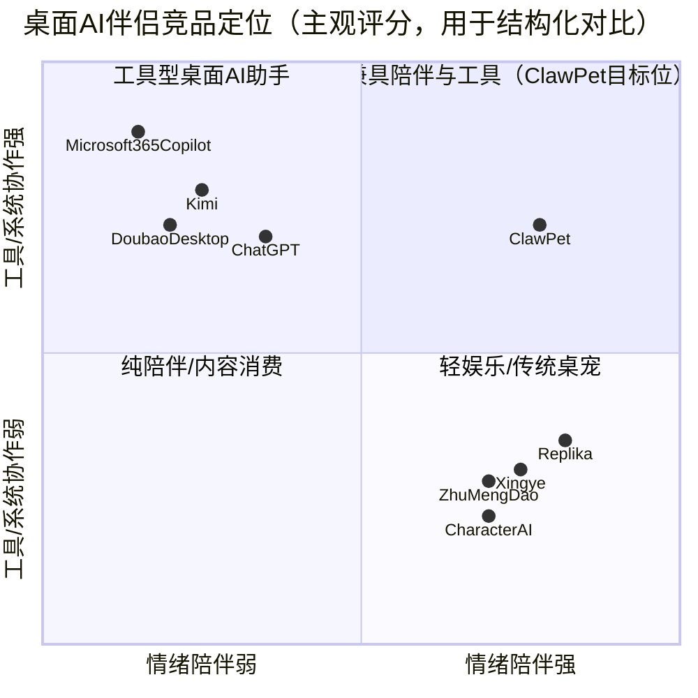
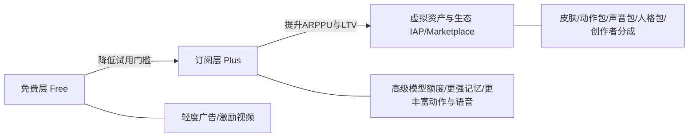
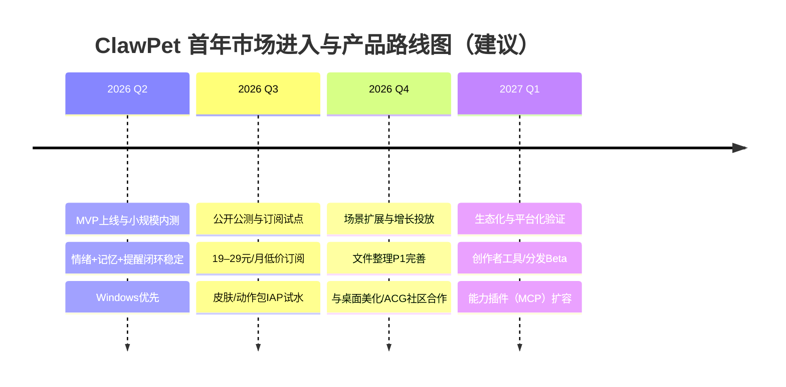

# ClawPet 智能虚拟桌宠市场调研报告

## 执行摘要

ClawPet（智能虚拟桌宠）在你提供的 PRD 中被定义为“**桌面虚拟陪伴 + 轻量辅助智能体**”，核心价值主张是把“**情绪价值（共情/陪伴/人格一致性）**”与“**桌面场景的低摩擦效率辅助（提醒/信息转译/轻量工具调用）**”合并成一个常驻桌面入口（Windows/macOS）。这一定位处在一个正在快速扩张但仍未定型的赛道交汇处：一端是快速普及的通用桌面 AI 助手（如多家厂商推出的 PC 客户端、系统级 Copilot 生态），另一端是移动端兴起的“AI 陪伴/虚拟角色”应用（强调人设、故事、情绪互动与内容消费）。从用户研究侧证看，AI 陪伴领域的用户对“实时互动方式、隐私保护、情绪感知能力”等基础属性高度一致认可，同时对“立绘审美/虚拟形象”也非常敏感；但付费意愿整体偏谨慎，更多用户倾向“看广告免费”或选择 **15–30 元/月**的低价订阅区间。citeturn6view0

市场空间层面，如果用“AI 陪伴应用”作为可比口径，第三方研究机构给出的全球市场规模与增速非常激进：例如有机构估算 **2024 年约 141 亿美元**并在 2025–2034 年保持 **约 26.8% CAGR**。citeturn0search2 同时，中国互联网用户规模与桌面设备触达也为“桌面常驻形态”提供了足够大的分母：截至 2024 年 6 月，中国网民约 **10.9967 亿**；使用台式电脑上网占比 **34.2%**、笔记本 **32.4%**（口径为“使用该设备上网”的网民占比）。citeturn22view0 在宏观投资侧，IDC 口径下中国 AI 投资与生成式 AI 投资占比仍处于高增长通道（多家媒体转述 IDC Spending Guide：到 2028 年中国 AI 总投资将突破 1000 亿美元、CAGR 35.2%；生成式 AI 到 2028 年投资规模超 300 亿美元、CAGR 51.5%）。citeturn24search1turn24search2

结论上，ClawPet 若要在“桌面 AI 助手”与“AI 陪伴内容应用”的夹缝中赢得长期位置，建议把差异化收敛到三个可验证的护城河：第一，**桌面场景的“低打扰主动性”**（基于记忆与情境，而非定时轰炸）；第二，**“本地优先+可解释可控”的隐私与权限体验**（满足合规也提升信任）；第三，**围绕桌宠形象的内容与创作生态**（可持续的皮肤/角色/能力订阅与分发）。在进入计划上，首年建议采取“**小高频人群（高压打工人/自由职业者/多线程工作者）→ 桌面工具闭环（提醒/信息转译/文件整理）→ 情感黏性机制（记忆、人设、动画状态机）→ 订阅+虚拟资产变现**”的路径，并用清晰的量化 KPI（留存优先）约束产品节奏与预算投放。

---

## PRD要点复盘与产品定位

**来自 PRD 的明确要点（关键信息摘取与归纳）**

ClawPet 的产品形态是“常驻后台服务 + 轻量化前端交互界面”；通过“感知—思考—执行”链路，在桌面持续感知事件并由 LLM 产出结构化结果（文本/情绪标签/tool_call），再驱动对话气泡、情绪动画引擎与工具调用层并行执行。产品核心能力被拆为：上下文感知、Multi-Agent 协作、系统能力调用、执行过程可控、记忆与学习、人格化与视觉表达。MVP 优先级包含：情绪识别+情感化回复+情绪动画（P0）、人格一致对话与长期记忆（P0）、天气查询与“有温度的转译”（P0）、记忆提取与主动提醒（P0）、文件拖拽整理（P1）。同时，PRD 对性能给出硬指标：启动 ≤3 秒、内存 ≤150MB（M2 验收条件）。

**定位一句话**

ClawPet = **桌面常驻的“虚拟桌宠入口” + 情绪共情能力 + 轻量工具闭环**，目标不是取代通用聊天，而是让用户在“电脑长期独处/高频任务切换/碎片事务”中获得“被关心 + 顺手被帮到”的体验。

**PRD 未明确、需要在调研中显式标注为“未指定”的要素**

为避免在后续市场与商业测算中引入隐性假设，以下关键项在 PRD 中未给出或未落到可执行口径（因此标注为“未指定”）：

| 类别 | 要素 | PRD 状态 | 对商业/产品的影响 |
|---|---|---|---|
| 市场与范围 | 首发地域/目标国家 | 未指定 | 决定合规框架（中国/海外）、语言、人群、渠道与定价可比口径 |
| 产品与体验 | 交互方式（是否含语音、唤醒词、快捷键标准、系统托盘策略） | 未指定 | 影响“常驻不打扰”的关键体验与留存 |
| 商业化 | 定价（订阅/买断/虚拟资产/IAP）、免费层限制 | 未指定 | 影响获客门槛、成本回收周期与ARPU上限 |
| 技术选型 | 客户端技术栈（Electron/Tauri/原生）、LLM 供应商（自研/第三方API/本地推理） | 未指定 | 决定性能指标可达性、推理成本、数据合规与迭代效率 |
| 数据与隐私 | 数据存储位置、留存周期、是否“默认不用于训练”、用户数据导出/删除机制 | 未指定 | 直接影响合规风险、信任与企业级扩展可能 |
| 内容与IP | 桌宠形象风格、Live2D 资产来源与授权策略、UGC/创作者生态规则 | 未指定 | 影响差异化与变现（皮肤/角色）天花板，以及版权风险 |
| 渠道 | 分发渠道（官网/微软商店/Steam/Mac App Store）、是否做预装合作 | 未指定 | 决定获客成本结构与增长速度 |

---

## 目标用户画像与需求洞察

**PRD 已定义的三类核心画像（作为“首发人群”）**

1) **高压打工人（22–35 岁）**：工作强度高、情绪消耗快，期待 AI 成为“情绪共鸣者”。  
2) **粗心独居者（20–30 岁）**：易忽视日常事项，期待“有温度的生活助手”，把天气/时间等信息转为关怀式提醒。  
3) **多线程工作者（25–40 岁）**：任务复杂、讨厌切换工具，期待“贴心记忆助手”，把随口表达沉淀为可唤起的提醒与辅助。

**需求洞察：把“陪伴”拆为可交付的产品能力**

从外部研究对 AI 陪伴产品的归纳来看，用户对产品属性存在明显共识：**实时互动方式、隐私保护、情绪感知能力**常被视为基础能力；在此之上，虚拟形象审美（立绘/2D/3D）也会显著影响进入率与持续互动。citeturn6view0  
这与 ClawPet 的设计（Live2D 表达、人设一致性、长期记忆、主动提醒）形成对齐，但也意味着：**“情绪识别+共情表达”必须稳定可控**，否则会从“贴心”迅速滑向“打扰/恐怖谷”。

**付费与价格敏感性（决定商业化策略的关键约束）**

外部调研显示，在缺乏高品质实体/强功能闭环的情况下，AI 陪伴产品整体付费意愿并不高；多数用户要么倾向广告换免费，要么选择低价包月（**15–30 元/月**）订阅。citeturn6view0  
这对 ClawPet 的启示是：首年商业化不宜过度依赖高客单价订阅（除非提供显著“效率闭环”或强差异化内容资产），更合理的方式是“**低门槛订阅 + 虚拟资产/个性化增值 + 可控的轻广告**”组合。

---

## 市场规模与增长

### 市场口径说明

由于 PRD 未指定地域，本报告默认以**中国市场为主**，并给出国际对照。中国市场又因“桌面 AI 虚拟伴侣”尚无统一统计口径，故采用“相邻可比市场 + 桌面可触达用户基数”做组合估算，并明确假设。

### 中国市场基础分母：桌面可触达人群

CNNIC 统计报告披露：截至 2024 年 6 月，中国网民约 **10.9967 亿**；其中“使用台式电脑上网”的网民占比 **34.2%**，“使用笔记本上网”占比 **32.4%**。citeturn22view0turn22view1  
这意味着“桌面端常驻产品”在中国具备足够大的覆盖潜力，但也要注意：上述比例并非去重后的“PC 独立用户”，同一用户可能同时使用多设备。

**推导（估算）：中国桌面可触达网民规模（去重区间）**

- 下界：按“台式电脑占比 34.2%”粗略下界 ≈ 10.9967 亿 × 34.2% ≈ **3.76 亿**（不计笔记本独立增量）。citeturn22view0  
- 上界：若台式与笔记本完全不重叠（极不现实），上界 ≈ 10.9967 亿 × (34.2%+32.4%) ≈ **7.32 亿**。citeturn22view0  
- 实务建议：以 **5.5 亿**作为“去重中位数假设”（用于后续 TAM/SAM/SOM，仅为建模方便，非事实数据）。

### 宏观增长动能：生成式 AI 投资高增速

多家媒体转述 IDC Spending Guide：到 2028 年中国 AI 总投资将突破 1000 亿美元、CAGR 35.2%；其中生成式 AI 投资到 2028 年占比将达到 30.6%、规模超 300 亿美元、CAGR 51.5%。citeturn24search1turn24search2  
这类宏观趋势对 ClawPet 的意义在于：**模型能力、算力/推理成本与“端侧/本地”能力都会在首年持续改善**，但巨头生态（OS/办公套件/浏览器）也会同步强化桌面入口竞争。

### 国际对照：AI 陪伴应用市场规模与增速

第三方研究机构 Global Market Insights 给出的口径：全球 AI companion app 市场 **2024 年约 141 亿美元**，并预测 2025–2034 年 **约 26.8% CAGR**。citeturn0search2  
另一个相邻市场“智能虚拟助手（IVA）”也呈现高增长：Grand View Research 估算全球 IVA 市场 2022 年约 24.8 亿美元，2030 年将达 141 亿美元，CAGR 24.3%。citeturn4search0  
两者共同说明：**“陪伴/助手”类的自然语言交互入口仍在快速扩张**，但统计口径差异较大，不能直接等同于 ClawPet 的细分市场。

### TAM/SAM/SOM（估算模型，含假设）

为把“市场空间”落到可执行目标，本节给出一个保守的首年规模推演框架（可按你后续的定价/渠道策略迭代参数）。

**假设（可调整）**  
A1. 中国桌面可触达去重网民：5.5 亿（见上文中位数假设）。  
A2. 其中愿意尝试“桌面陪伴+轻量辅助”的潜在人群占比：30%（参考 AI 陪伴意愿与桌面人群差异，保守取值；并非直接引用某一调查结论）。  
A3. PRD 三类核心画像可覆盖潜在人群的 30%（首发聚焦人群）。  
A4. 首年可实际触达并沉淀为活跃用户（SOM）为 SAM 的 1%（桌面应用增长通常较慢，且需要适配/口碑与内容供给）。

据此：

| 指标 | 公式 | 结果（约） | 说明 |
|---|---|---:|---|
| TAM（潜在可用市场，人数） | 5.5 亿 × 30% | **1.65 亿** | 代表“愿意尝试这类桌面产品”的量级 |
| SAM（首年聚焦可服务市场，人数） | TAM × 30% | **4950 万** | 对齐 PRD 三类核心画像 |
| SOM（首年可获取市场，人数） | SAM × 1% | **49.5 万** | 与“首年桌面端产品冷启动难度”匹配 |

> 解读：若 ClawPet 首年能做到 **~50 万级累计有效用户**（或等价的注册/激活），已经接近该模型的“保守可行上限”。后续需用实际渠道 CAC、次日/7日/30日留存去校准假设。

---

## 竞品格局与对比分析

### 竞品格局：三大阵营正在“挤压中间地带”

用“情绪陪伴强弱 × 工具/系统协作强弱”来观察竞品，会发现 ClawPet 试图占据的象限（高陪伴+中高工具）目前尚未被单一产品稳定统治，但竞争压力来自两侧挤压：



> 注：该象限图是分析工具，不是事实测量；评分基于公开功能定位与产品形态，用于帮助决策“差异化该押在哪”。

### 主要竞品列表与功能/价格/渠道对比

下表选择“与你的产品形态/价值主张”最接近或最可能争夺用户时长/注意力的代表性竞品（覆盖：桌面通用助手、移动陪伴、海外陪伴）。价格以公开信息为准；未公开部分标注为“未指定/未公开”。

| 产品 | 阵营 | 核心定位（公开信息/产品认知） | 关键能力对比（陪伴/记忆/工具/形象） | 价格（公开） | 主要渠道 |
|---|---|---|---|---|---|
| **ClawPet** | 目标产品 | 桌面虚拟陪伴 + 轻量辅助智能体（PRD） | 情绪识别+动画反馈；长期记忆；天气/提醒/文件整理等工具；Live2D 桌宠形象 | **未指定** | Windows/macOS 桌面端（PRD） |
| ChatGPT（Plus） | 桌面通用助手 | 通用对话与生产力工具 | 有“记忆/文件/语音”等能力，但形象化陪伴弱；桌面常驻能力依赖客户端与OS | **$20/月**（官方帮助中心）citeturn30view0 | Web/iOS/Android/桌面客户端（随地区而异） |
| ChatGPT（Pro） | 桌面通用助手（高端） | 更高上限与更强工具/推理 | 强工具与推理；但定位偏高客单价生产力 | **$200/月**citeturn16view1 | 同上 |
| Microsoft 365 Copilot Business | 系统/办公生态 | 深度嵌入 Office/Teams 的企业级 Copilot | 强“工作流/文档/协作”上下文；陪伴与人格化弱 | **¥195.60/用户/月（包月）**citeturn8view1 | Microsoft 365 生态（企业） |
| 豆包桌面版 | 桌面通用助手 | 桌面 AI 助手，覆盖写作/翻译/截图提问/划词等 | 偏工具效率；陪伴与形象化弱 | 未公开（多为免费/内购策略） | 桌面客户端下载页citeturn18search0 |
| Kimi（Windows 端） | 桌面通用助手 | 强调Agent/办公/深度搜索的“随身Agent助理” | 工具与Agent能力强；陪伴弱；会员体系存在但价格抓取受限 | 会员价格网页抓取受限；第三方信息称有多档订阅（**未完全可核验**）citeturn34search0turn34search1 | Microsoft Store（Windows）citeturn18search2 |
| 星野（MiniMax） | 移动陪伴/角色内容 | 沉浸式“智能体社区”，强调剧情与角色定制 | 强人设/剧情/形象定制；工具性弱（桌面系统协作少）citeturn17search0turn6view0 | 未公开/内购（未在官网明示） | 官网下载与移动端分发citeturn17search0 |
| 猫箱 | 移动陪伴/角色内容 | 多样 AI 角色对话与“专属故事”创作 | 情绪/角色互动强；工具性弱 | 未公开/内购（官网未明示）citeturn17search1 | App/移动端为主 |
| 筑梦岛 | 移动陪伴/角色内容 | “AI虚拟人物沉浸互动”，支持群聊/梦境内容 | 偏内容消费与互动；工具性弱 | VIP **16元/月**；SVIP **36元/月**（App Store）citeturn26view0 | iOS App Store（及其他移动商店）citeturn26view0 |
| Replika | 海外陪伴 | AI companion，强调“更好记忆+主动关怀+通话/视频” | 陪伴强、主动 check-in；工具性中等（集成/上网）；虚拟形象可定制 | IAP 显示存在多档（如 **$7.99/月、$14.99/月** 等，且有年费档）citeturn33view0 | iOS/Android/Web（海外为主）citeturn33view0 |
| Character.AI（c.ai+） | 海外角色内容 | 大规模角色对话与UGC角色生态 | 角色丰富、内容消费强；工具性弱 | 年订阅折算 **$7.92/月**（官方页面摘要）citeturn9search1 | Web/iOS/Android |

### 竞品优劣势：ClawPet 的“中间路线”风险与机会

**机会（可被验证的结构性空白）**  
1) **桌面端“常驻陪伴+轻量执行”一体化不足**：多数陪伴产品在移动端，工具能力弱；而桌面效率产品缺少拟人化与情绪价值。citeturn6view0turn18search0turn18search2  
2) **低价订阅区间存在共识**：用户更愿意接受 15–30 元/月或广告换免费。citeturn6view0turn26view0  
3) **形象与审美是增长杠杆**：陪伴赛道对虚拟形象审美高度敏感（立绘/动画）。citeturn6view0

**挑战（“中间路线”常见失败点）**  
1) **两边都不够强**：若工具能力闭环不如通用助手、情绪体验不如陪伴应用，用户会回归“一个效率工具 + 一个陪伴App”的组合。  
2) **主动性边界极易翻车**：主动提醒若缺乏“可解释依据”和频率控制，会迅速从“关心”变成“打扰”。citeturn6view0  
3) **桌面分发比移动更难**：桌面应用天然需要更强的口碑、内容传播点与安装动机（尤其是非刚需工具）。  

---

## 商业模式、渠道与合规壁垒

### 商业模式与变现路径建议

结合 PRD 能力与外部价格偏好信号（低价订阅/广告），建议把商业化设计为“三层结构”，避免单一订阅承压：



**建议的具体形态（首年可落地）**
- Free：基础对话+基础桌宠形象+有限记忆/每日提醒次数（门槛最低，服务增长）。  
- Plus（建议定价对齐用户心理价位）：**19–29 元/月**（参考用户更偏好 15–30 元/月区间citeturn6view0，以及国内同类订阅价如筑梦岛 VIP 16 元/月citeturn26view0）。  
- IAP/商城：桌宠皮肤、动作、配音、主题场景、联名 IP；以及“能力插件包”（如高级整理/多应用联动）。  
- 长期（PRD 愿景一致）：开放创作与分发，形成“桌宠平台”，平台抽成。

### 用户获取与留存渠道

**获客（Acquisition）渠道组合（桌面产品的现实约束）**
- 应用商店分发：Microsoft Store（Windows）、Mac App Store（若上架，需评估审核策略）。  
- 内容平台种草：B 站/小红书/抖音以“桌面陪伴+治愈动画+效率小技巧”展示；陪伴产品往往靠“角色与情绪瞬间”传播。citeturn6view0  
- ACG/Live2D 社区合作：Live2D 生态本身成熟，但注意 SDK 商用授权与费用规则。citeturn29search1turn29search2  
- 联盟与合作：与效率工具作者、桌面美化/桌面宠物社区、远程办公社群合作投放。  

**留存（Retention）抓手（与 PRD 强绑定）**
- 记忆驱动的“轻主动”：只在“有依据”（用户说过/日历/明确偏好）时触发，并提供“一键解释：为何提醒我”。  
- 形象成长体系：亲密度/心情状态/动作解锁，把“使用桌面工具”转译为“陪伴关系进展”。  
- 情绪安全阀：提供“勿扰模式/工作模式/夜间模式”，把主动性权交给用户（降低打扰风险）。citeturn6view0

### 法规/合规/行业壁垒（中国为主）

由于 ClawPet 涉及“生成式对话 + 可能的情绪识别 + 桌面事件感知 + 外部工具调用”，合规要同时覆盖“个人信息保护”和“生成式/算法/深度合成治理”。

**个人信息保护（PIPL）关键要求与产品含义**
- 适用范围：在境内处理个人信息适用；在境外处理但以向境内个人提供产品/服务或分析评估境内个人行为的，也适用。citeturn39view0  
- 基本原则：合法正当必要、最小范围、公开透明等。citeturn39view0turn39view1  
- 处理个人信息的合法性基础：通常需要取得同意，或满足合同履行等法定情形。citeturn39view1  
- 敏感个人信息：包括生物识别、医疗健康、行踪轨迹等，以及不满 14 周岁未成年人信息；处理敏感信息需“特定目的与充分必要性+严格保护措施”，并通常需要“单独同意”。citeturn39view2  

> 对 ClawPet 的直接影响：如果“情绪识别”涉及对用户心理/健康状态的推断，或采集更高敏感度的行为数据（如应用使用轨迹、文件内容摘要），需要把“最小化采集、显式告知、可撤回、可删除导出”做进产品默认能力，而不是事后补文档。

**生成式 AI/算法/深度合成监管要点（需要结合你最终上线形态判断适用性）**
- 《生成式人工智能服务管理暂行办法》自 2023-08-15 起施行（官方发布信息）。citeturn25search0  
- 《互联网信息服务算法推荐管理规定》与《互联网信息服务深度合成管理规定》对境内互联网信息服务的算法推荐与深度合成活动提出治理要求。citeturn2search1turn2search2  

**行业壁垒（除了监管，更现实的是“信任”与“生态”）**
- 信任壁垒：桌面常驻、读写文件、监听拖拽/快捷键的产品天然更敏感，用户更在意“是否上传、上传什么、是否可关闭”。  
- 内容/IP壁垒：Live2D 等形象资产商用可能涉及授权费用与条款；Live2D 官方对“运用型内容（游戏/应用）”存在按平台与地区、按企业规模计费的授权方案。citeturn29search2  

---

## 技术可行性、风险与市场进入计划

### 技术实现难点与可行性评估

结合 PRD 的能力边界与性能指标（启动≤3s、内存≤150MB），核心难点集中在“常驻桌面工程化”而非单纯模型能力：

1) **桌面上下文感知的边界与稳定性**：跨 Windows/macOS 获取前台应用、窗口标题、选中文本、文件拖拽等，需要细粒度权限与兼容性治理；过度感知会触发隐私疑虑与合规压力。  
2) **情绪识别的可靠性与“可控表达”**：用户对陪伴产品的情绪感知能力期待高，但误判会伤害信任；因此需要“情绪状态机 + 回退策略”（PRD 已强调不完全依赖 LLM 实时判断）。  
3) **长期记忆的“写入质量”与“唤起准确性”**：记忆体量大后，检索与总结会导致上下文膨胀与成本上升；需要记忆分层（偏好/事实/计划/情绪）与过期策略。  
4) **工具调用的安全与可解释性**：本地文件整理、应用启动器、命令行调用等必须具备强确认机制与沙箱，避免“幻觉指令”导致误操作。  
5) **成本与延迟**：常驻陪伴意味着“低延迟、低成本、可控额度”；纯云推理在高 DAU 下成本压力会非常快显现，需要端侧轻模型/缓存/分级路由策略。

> 可行性判断：PRD 的结构化输出（text/emotion/tool_call）与状态机设计，属于当前 Agent 工程中更成熟的实现范式；真正的成败点在于“桌面权限/性能/安全”三角能否同时达标，以及“主动性”是否可被用户接受。

### 风险与应对策略

| 风险 | 触发场景 | 影响 | 应对策略（优先级从高到低） |
|---|---|---|---|
| 隐私与信任崩塌 | 桌面监控被误解为“偷看文件/截图上传” | 直接导致卸载与负面传播 | 默认最小化采集；所有敏感能力“显式开关+可视化指示灯”；本地优先；提供数据导出/删除（对齐 PIPL 原则）citeturn39view0turn39view1 |
| 主动提醒变打扰 | 频率过高/时机不当/无解释 | 留存下降、差评 | 分层勿扰/工作模式；每次主动行为附“理由”；学习用户反馈（点踩/静音）citeturn6view0 |
| 与通用桌面 AI 助手同质化 | 只做聊天/翻译/总结等“通用能力” | 竞争进入红海 | 押注“桌宠形象+情绪价值+长期记忆+轻工具闭环”，避免泛工具化 |
| 商用授权与IP纠纷 | Live2D/角色素材未清晰授权 | 法务风险、下架 | 建立素材来源与授权台账；评估 Live2D SDK 应用授权成本与条款citeturn29search2 |
| 合规不确定性 | 提供生成式内容、可能涉及深度合成/算法推荐 | 监管风险 | 上线前做内容安全与投诉机制；按生成式AI、深度合成、算法推荐要求准备治理体系citeturn25search0turn2search2turn2search1 |
| 推理成本失控 | DAU 增长但单用户对话/工具调用频繁 | 毛利为负 | “轻重模型分层 + 额度体系”；订阅绑定更高额度；端侧缓存与批处理 |

### 推荐的差异化策略与市场进入计划（含首年 KPI 与预算估算）

**差异化策略（建议优先级）**

1) **“桌面低打扰主动性”成为标识性卖点**  
把“主动提醒”做成可被用户理解和掌控的能力：每一次提醒都回答两件事——“我为什么现在提醒你？”与“你不想被提醒时如何一键关闭？”（对齐 PIPL 的透明原则也更容易赢得信任）。citeturn39view0

2) **本地优先（Local-first）与隐私可视化**  
在能力上区分“本地完成”和“需上云”；能本地做的（如简单分类、规则提醒、文件路径识别）尽量本地做；上云必须明确告知并可关闭。合规上遵循“最小必要、公开透明”。citeturn39view0turn39view1  

3) **内容与审美驱动增长：Live2D + 皮肤经济**  
AI 陪伴赛道对“形象审美”敏感，ClawPet 用 Live2D 作为桌宠载体是明确优势；但需提前把“资产授权与创作者分发”纳入路线图，并评估 Live2D SDK/素材商用成本。citeturn6view0turn29search2

4) **用“轻工具闭环”证明长期价值**  
相比纯陪伴，桌面端必须解决“顺手帮我做一件小事”的闭环，例如：从聊天里抽取待办→自动生成提醒→到点弹窗→用户一键确认/延后；或文件拖拽→建议分类→用户确认→执行并回报结果。

**市场进入节奏（首年路线图）**



**首年 KPI 建议（按“留存优先、付费次之”设计）**

| KPI 类别 | 指标 | Year 1 目标（建议区间） | 设定逻辑 |
|---|---|---:|---|
| 规模 | 累计下载/安装 | 80–120 万 | 桌面产品靠口碑与内容传播，先追“安装量级” |
| 激活 | 7日激活率（安装→完成引导并产生一次有效对话/提醒） | 35–45% | 反映引导与首个 Aha Moment 质量 |
| 活跃 | MAU | 15–25 万 | 与“首年SOM~50万”的保守模型相匹配（需靠留存支撑） |
| 留存 | D1 / D7 / D30 留存 | 35% / 20% / 12%（目标） | 陪伴产品必须以留存定义产品力 |
| 质量 | 用户主动关闭率（对主动提醒/权限） | <10%（30日内） | 直接衡量“打扰程度” |
| 变现 | 付费转化（MAU→付费） | 3–6% | 对齐低价订阅心智（15–30元/月）citeturn6view0 |
| 变现 | ARPPU（月） | 25–35 元 | 订阅 + 少量 IAP 的组合 |
| 口碑 | NPS / 应用商店评分 | NPS>30；评分≥4.3 | 桌面分发极度依赖口碑 |

**首年预算估算（人民币，需你补齐团队与成本结构后再校准）**

> 预算属于“估算”，不引用外部统计；核心是给出可复制的计算方法与可调参数。

- 人力（研发+产品+设计+运营）：假设 7 人小队，综合人力成本 4.5 万/人/月（含社保福利与办公摊销），全年约：7×4.5万×12 ≈ **378 万**。  
- 算力/推理成本：建议按“DAU×人均对话轮次×单轮 token×单价/1M token”建模；首年预留 **80–150 万**作为“峰值冗余+灰度试错”。  
- 内容与素材（Live2D 模型、动作、音色、联名）：首年建议预留 **60–120 万**；若使用 Live2D SDK/商用授权，需另算授权费用。citeturn29search2  
- 市场投放与合作：以“内容种草+社区合作”为主，预留 **80–200 万**（桌面端不建议一开始重信息流买量）。  
- 合规与法务（隐私政策、数据处理协议、内容治理流程）：预留 **20–50 万**（视地区与上线范围波动）。  

**合计建议区间：约 620–900 万元/年**（取决于推理方式与投放强度；若走“强云推理+快速买量”，上限需上调）。

---

## 结论与可执行建议

1) **把产品成功标准从“功能齐全”切换为“关系成立 + 闭环成立”**  
ClawPet 的核心不是再做一个桌面聊天框，而是让用户形成稳定心智：它“懂我（情绪与记忆）”并且“能帮我（轻工具闭环）”。在竞品两侧挤压下，任何偏离这一点的功能扩张都会增加同质化风险。

2) **首年优先交付三条“可复用壁垒”能力**  
第一，主动性边界系统（勿扰/工作模式/触发解释/频率学习）；第二，本地优先与隐私可视化（最小化采集、可撤回、可删除导出）；第三，内容资产体系（Live2D 形象、动作、皮肤与可扩展的创作者供给）。其中第三条必须同步解决版权与授权台账，避免后期规模化时踩雷。citeturn39view0turn29search2

3) **商业化建议采用“低价订阅 + IAP/皮肤经济 + 轻广告可选”**  
用户对 AI 陪伴产品更偏好“广告换免费”或 15–30 元/月低价订阅。citeturn6view0turn26view0 因此首年不建议高价订阅“硬拔 ARPU”，而应把订阅与“更强记忆/更稳定高峰体验/更丰富形象与动作/更高工具额度”绑定，并逐步用皮肤与创作者生态抬升 ARPPU。

4) **用 KPI 约束节奏：留存优先于新增，质量优先于规模**  
桌面端增长更依赖口碑与内容传播。建议把 D30 留存、主动提醒关闭率、权限拒绝率、崩溃率/启动耗时等指标放到与下载量同等优先级；否则“常驻桌面”会变成负面口碑放大器。

5) **明确未指定项并尽快补齐（建议优先级）**  
最需要你补齐的 PRD 空白是：首发地域与合规策略、定价与免费层阈值、LLM 与推理形态（云/端/混合）、素材与授权策略、分发渠道（是否上架商店/Steam）。这些决定了市场进入的“可行路径”，也决定预算模型该用哪一套。

---

```text
主要数据来源（URL）
- CNNIC 第54次统计报告（PDF）：https://www.cnnic.com.cn/IDR/ReportDownloads/202411/P020241101318428715781.pdf
- 腾讯新闻：十问“AI陪伴”：现状、趋势与机会：https://news.qq.com/rain/a/20241023A0889Z00
- Global Market Insights：AI Companion App Market：https://www.gminsights.com/industry-analysis/ai-companion-app-market
- Grand View Research：Intelligent Virtual Assistant Market：https://www.grandviewresearch.com/industry-analysis/intelligent-virtual-assistant-industry
- IT之家（转述IDC Spending Guide）：https://www.ithome.com/0/843/460.htm
- OpenAI Help Center（ChatGPT Plus）：https://help.openai.com/en/articles/6950777-what-is-chatgpt-plus
- OpenAI Help Center（ChatGPT Pro）：https://help.openai.com/en/articles/9793128-what-is-chatgpt-pro
- App Store（筑梦岛）：https://apps.apple.com/cn/app/%E7%AD%91%E6%A2%A6%E5%B2%9B/id6465838500
- App Store（Replika）：https://apps.apple.com/us/app/replika-ai-friend/id1158555867
- Live2D 官方（产品与展示）：https://www.live2d.com/zh-CHS/
- Live2D SDK 授权方案示例（运用型内容）：https://www.live2d.com/zh-CHS/sdk/license/running_plan01/
- PIPL（个人信息保护法，政府站点PDF）：https://www.jsmm.gov.cn/u/cms/www/202110/1317253417oi.pdf
- 生成式人工智能服务管理暂行办法（中国政府网条目）：https://www.gov.cn/zhengce/zhengceku/202307/content_6891752.htm
- 算法推荐管理规定（中国政府网条目）：https://www.gov.cn/zhengce/2022-11/26/content_5728941.htm
- 深度合成管理规定（中国政府网条目）：https://www.gov.cn/zhengce/zhengceku/2022-12/12/content_5731431.htm
```